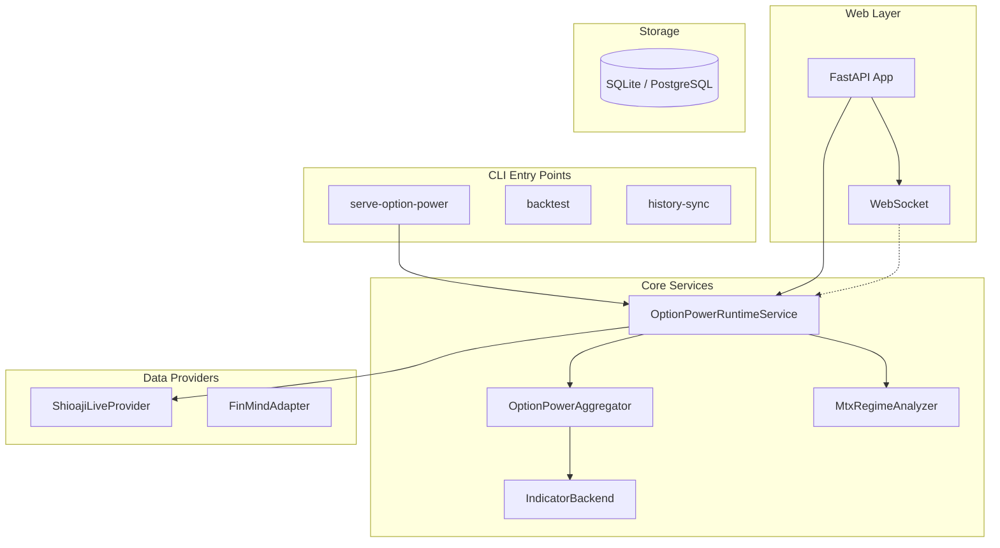
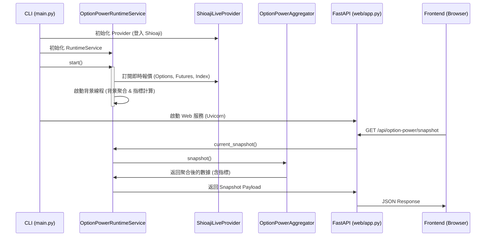

# qt-platform 架構文件

本文件說明 `qt-platform` 的核心架構、執行流程以及如何擴展系統。

## 1. 系統總覽



## 2. `serve-option-power` 執行流程

當執行 `serve-option-power` 時，系統會啟動即時數據監控與 Web 服務。



## 3. 如何新增指標 (Indicator)

系統中有兩類指標：**OptionPower 指標** (用於即時監控) 與 **Strategy 指標** (用於回測)。

### A. 新增 OptionPower 指標 (即時監控)
這類指標通常在 `src/qt_platform/option_power/indicator_backend.py` 中定義與計算。

1.  **定義名稱**: 在 `INDICATOR_SERIES_NAMES` 列表中新增你的指標名稱。
2.  **計算邏輯**: 
    - 如果指標是基於單一時間點的 (Snapshot)，在 `_snapshot_indicator_row` 中添加對應的處理。
    - 如果指標是基於時間序列的 (Windowed)，在 `_populate_python_windowed_indicators` 中添加滾動計算邏輯。
3.  **聚合**: 確保 `OptionPowerAggregator` 會收集到相關數據。

### B. 新增 Strategy 指標 (回測)
用於 `BaseStrategy` 的指標。

1.  **繼承 `BaseIndicator`**: 在 `src/qt_platform/strategies/base.py` 或具體策略文件中繼承。
2.  **實作 `on_bar` / `on_tick`**: 更新指標內部狀態。
3.  **實作 `snapshot`**: 返回目前指標數值。

參考 `src/qt_platform/strategies/sma_cross.py` 中的 `SmaIndicator`。

## 4. 如何將指標放到 API Response 給前端

1.  **RuntimeService 更新**: 指標計算完成後，會存放在 `OptionPowerRuntimeService` 的 `_snapshot_history` 或 `_kronos_latest_metrics`。
2.  **Snapshot Payload**: 在 `OptionPowerRuntimeService.current_snapshot()` 方法中，將新的指標數值放入返回的 `dict`。
3.  **Frontend 調用**: 前端會透過 `/api/option-power/snapshot` 或 WebSocket `/ws/option-power` 取得數據。

## 5. 如何新增 Backtest 策略 (Strategy)

1.  **建立策略類別**: 繼承 `BaseStrategyDefinition` (推薦) 或 `BaseStrategy`。
    - 位置: `src/qt_platform/strategies/`
2.  **實作核心組件**:
    - `indicators()`: 返回策略所需的指標字典。
    - `signal_logic()`: 定義買賣訊號邏輯。
    - `execution_policy()`: 定義下單大小與倉位控制。
3.  **註冊到 CLI**:
    - 在 `src/qt_platform/cli/main.py` 的 `_backtest` 函數中，根據參數實例化你的策略。

範例:
```python
class MyNewStrategy(BaseStrategyDefinition):
    def __init__(self, param1=10):
        self._indicators = {"my_ind": MyIndicator(param1)}
        self._signal_logic = MySignalLogic()
        self._execution_policy = FixedSizeExecutionPolicy(trade_size=1)
    # ... 實作其他必要方法
```
