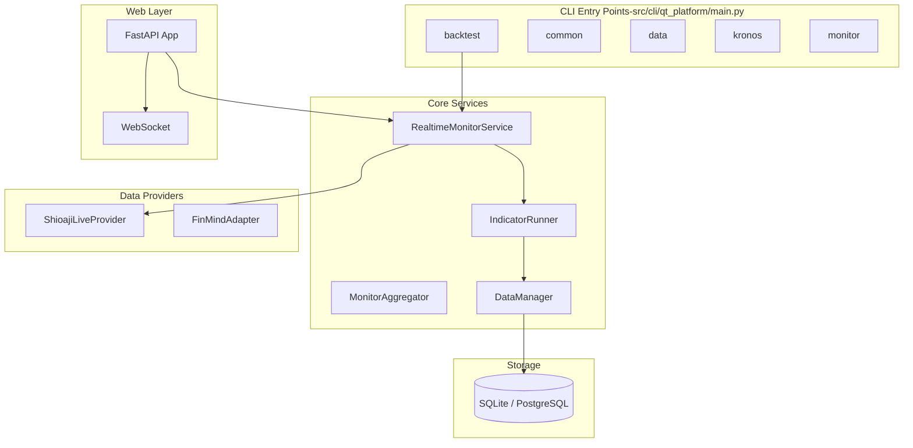
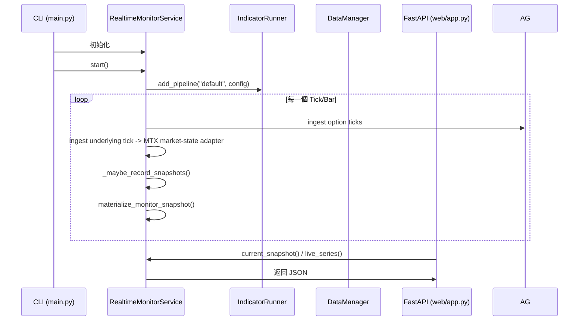

# qt-platform 架構文件 (重構後)

本文件說明 `qt-platform` 的核心架構、執行流程以及如何擴展系統。

## 1. 系統總覽

## 2. 指標架構 (Indicator Architecture)

系統採用「邏輯槽位 (Logical Slots)」設計，將指標運算與具體資料流解耦。

### 核心組件：
- **Indicator**: 純演算法邏輯，宣告需要的 `input_slots` 與 `dependencies`。
- **DataManager**: 管理 L1 (In-Memory) 滾動快取，支援從 DB 自動回補 (Hydration)。
- **IndicatorRunner**: 管理多個 **Pipeline** (如 1m, 5m)，按 DAG 順序執行運算。
- **Lease/GC**: 自動銷毀長時間未被存取的指標管道。

### 實務分層準則：
- `src/qt_platform/indicators/collection/` 放「可重用指標」，預設只依賴 price / volume / ticks。
- `src/qt_platform/indicators/catalog.py` 放「哪些指標要暴露到 monitor/live/replay」的 catalog，而不是把系列名散落在各服務。
- `qt_platform.market_state.mtx` 是 MTX 專屬的 market-state adapter，不是所有 indicator 的基礎語彙。對外 API 目前仍保留 `regime` 欄位相容，但內部新邏輯應優先使用 `market_state` / `requires_market_state` 這種語意。
- `monitor/*` 應只負責 orchestration、snapshot、transport；不要在 monitor service 內再發明一套獨立 indicator 名單或派生公式。

### 建議的開發體驗：
1. 在 `indicators/collection/` 新增指標，先只關心輸入與輸出。
2. 若要進 live / replay 顯示，再把名稱加入 `indicators/catalog.py`。
3. 若 live 不再觀察，但 backtest 仍要用，不應回頭改 monitor service；只調整對應 pipeline / strategy 的配置。
4. 若是像 option pressure 這種特殊輸入型指標，例外只留在 input mapping，不要把整個指標框架綁死在 option domain。

## 3. `monitor live` 執行流程

### 目前最終版 live snapshot 組裝
1. `MonitorAggregator` 只負責 option contracts / pressure / iv surface / snapshot base payload。
2. `MtxRegimeAnalyzer` 只負責 MTX market-state 計算。
3. `monitor/snapshot_builder.py` 將 base snapshot materialize 成最終 snapshot：
   - 保留相容的 `regime` nested payload
   - 依 `indicators/catalog.py` 補齊 top-level indicator fields
   - 合併 Kronos live metrics
4. `live_series()` / replay series 再統一透過 `monitor/indicator_backend.py` 產出序列。

這代表：
- live 不再在 service 內維護一套 proxy indicators 再手動 merge。
- replay / live 都依賴同一組 indicator catalog 與同一套 series builder。
- 若未來要抽換 MTX market-state adapter，只需要替換 `qt_platform.market_state.mtx` 與 snapshot materialization，不必重寫前端 series 契約。

### replay / data-flow 規則
1. replay 有兩條 materialization path：
   - background session build：`_build_window_frames()` 產出 frame cache，供 `get_snapshot_at()` 與非 interval series 使用。
   - chart interval build：`_materialize_chart_session_window()` 直接產出 interval snapshots，供 `get_series_payload(..., interval=...)` / bundle API 使用。
2. 這兩條路徑都必須遵守同一個 replay causality 規則：`MonitorAggregator.seed_contract(...)` 只能用「replay 起點當下以前已觀測到的 option ticks」建立空 state，不能拿未來才第一次出現的合約提前 seed。
3. 原因不是只有合約列表相容性。`raw_pressure` / `pressure_index` 會依賴全體已知合約推導 strike step 與 expiry weighting；若把未來合約提前 seed，早期 snapshot 會被未來 strike lattice 重新加權，形成 look-ahead bias。
4. 因此 replay 的正確順序是：
   - 先用 `tick.ts <= replay_start` 的 ticks seed 已知合約骨架
   - 再按 evaluation boundary 順序 ingest `tick.ts <= evaluation_time` 的 ticks
   - 最後用當下 aggregator state materialize pressure / regime snapshot
5. 後續若再改 replay cache/checkpoint，必須維持這個規則；checkpoint 可以重用「過去已處理 state」，但不能把尚未發生的 contract discovery 帶回較早時間點。

## 4. 如何新增指標 (Indicator)

1.  **實作指標類別**: 在 `src/qt_platform/indicators/collection/` 建立新檔案。
    - 繼承 `Indicator`。
    - 使用 `@register_indicator` 註冊。
    - 宣告 `input_slots` (例如 `{"src": StreamType.BAR}`)。
2.  **加入 catalog**: 若該指標要被 live / replay / backtest 共用，將它的 series 名稱與分類補到 `src/qt_platform/indicators/catalog.py`。
3.  **註冊到服務**: 在 `RealtimeMonitorService` 或對應的 Feature 配置中，將該指標加入 Pipeline。
4.  **前端調用**: 指標結果會自動出現在 API 的 `snapshot` / `series` 中。

### 什麼應該放哪裡
- `indicators/collection/*`
  放可單獨測試、可在多場景重用的計算邏輯。
- `indicators/catalog.py`
  放 monitor/replay/live 要暴露哪些 indicator，以及它們的分類與 stateful 屬性。
- `monitor/indicator_backend.py`
  放 snapshot -> series 的轉換與衍生欄位規則。
- `monitor/snapshot_builder.py`
  放 live snapshot materialization，避免 service 裡散落 merge 邏輯。
- `monitor/service.py`
  只負責 orchestration、session lifecycle、provider/store、Kronos trigger，不直接持有另一套 indicator 規則。
- `monitor/replay.py`
  內部應以 `market_state` 作為 warm-cache / checkpoint / fetch decision 的語彙；`regime` 只保留給既有 snapshot payload 與 schema 相容層。

## 5. 如何新增 Backtest 策略 (Strategy)

1.  **建立策略類別**: 繼承 `BaseStrategyDefinition`。
    - 位置: `src/qt_platform/strategies/`
2.  **實作核心組件**:
    - `indicators()`: 返回所需的指標。
    - `signal_logic()`: 定義買賣訊號。
3.  **註冊到 CLI**: 在 `src/qt_platform/cli/main.py` 的 `_backtest` 函數中註冊。

## 6. 當前技術債與後續原則

- 外部 API 仍保留 `snapshot.regime` 與 `regime_schema`，這是相容層，不代表未來新模組應持續擴散 `regime` 命名。
- 內部新代碼若只是表達「是否需要 MTX market state」，優先使用 `market_state` / `requires_market_state`，不要再新增新的 `*regime*` 命名。
- `qt_platform.market_state.mtx` 目前仍是 MTX 專屬 adapter；若之後有其他 underlying 的 market-state，要以新 adapter 平行擴充，而不是把 MTX 規則硬塞進通用 indicator 基底。
- 若某指標只想在 backtest 用，不要修改 `monitor/service.py`；應只改 strategy / pipeline 配置。
- 若某指標只需要從 live UI 移除，不要刪除核心邏輯；先從 `catalog` 或前端 panel 配置調整。
