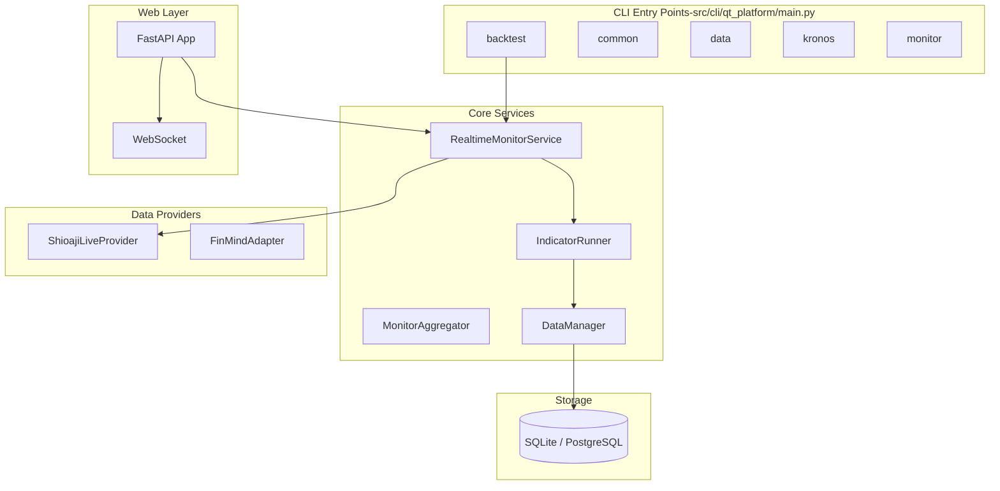
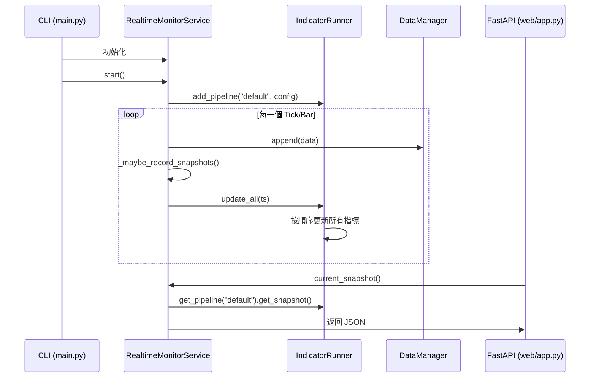

# qt-platform 架構文件 (重構後)

本文件說明 `qt-platform` 的核心架構、執行流程以及如何擴展系統。

## 1. 系統總覽

## 2. 指標架構 (Indicator Architecture)

系統採用「邏輯槽位 (Logical Slots)」設計，將指標運算與具體資料流解耦。

### 核心組件：
- **Indicator**: 純演算法邏輯，宣告需要的 `input_slots` 與 `dependencies`。
- **DataManager**: 管理 L1 (In-Memory) 滾動快取，支援從 DB 自動回補 (Hydration)。
- **IndicatorRunner**: 管理多個 **Pipeline** (如 1m, 5m)，按 DAG 順序執行運算。
- **Lease/GC**: 自動銷毀長時間未被存取的指標管道。

## 3. `monitor live` 執行流程

## 4. 如何新增指標 (Indicator)

1.  **實作指標類別**: 在 `src/qt_platform/indicators/collection/` 建立新檔案。
    - 繼承 `Indicator`。
    - 使用 `@register_indicator` 註冊。
    - 宣告 `input_slots` (例如 `{"src": StreamType.BAR}`)。
2.  **註冊到服務**: 在 `RealtimeMonitorService` 或對應的 Feature 配置中，將該指標加入 Pipeline。
3.  **前端調用**: 指標結果會自動出現在 API 的 `snapshot` 中。

## 5. 如何新增 Backtest 策略 (Strategy)

1.  **建立策略類別**: 繼承 `BaseStrategyDefinition`。
    - 位置: `src/qt_platform/strategies/`
2.  **實作核心組件**:
    - `indicators()`: 返回所需的指標。
    - `signal_logic()`: 定義買賣訊號。
3.  **註冊到 CLI**: 在 `src/qt_platform/cli/main.py` 的 `_backtest` 函數中註冊。
